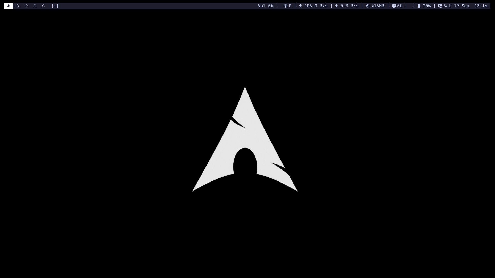
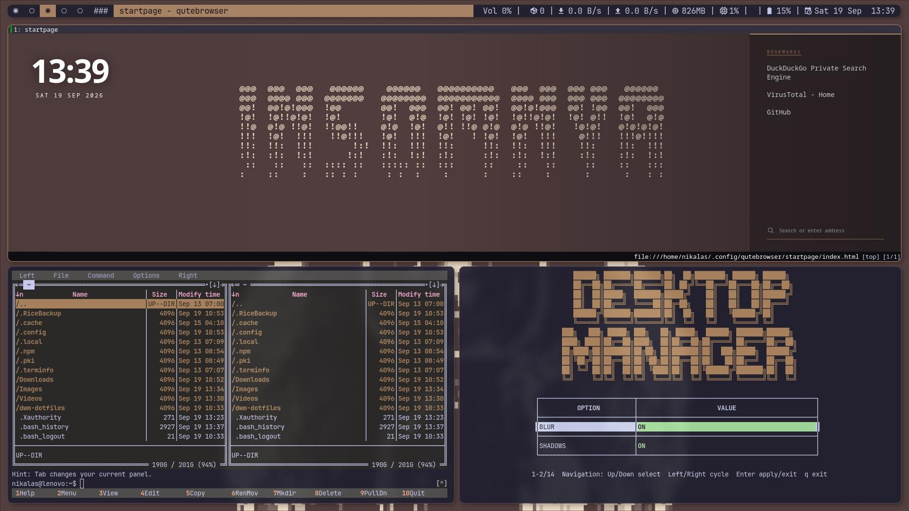
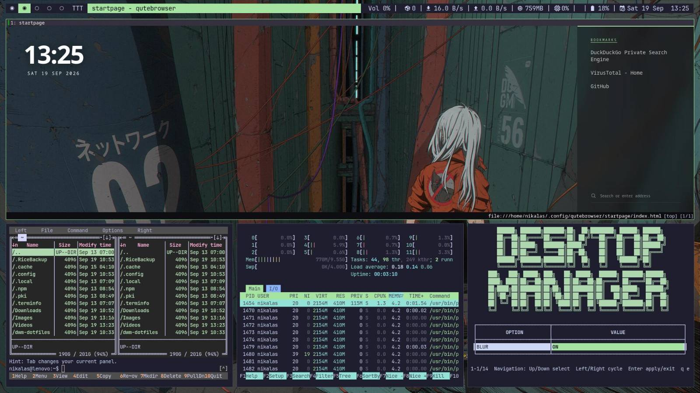
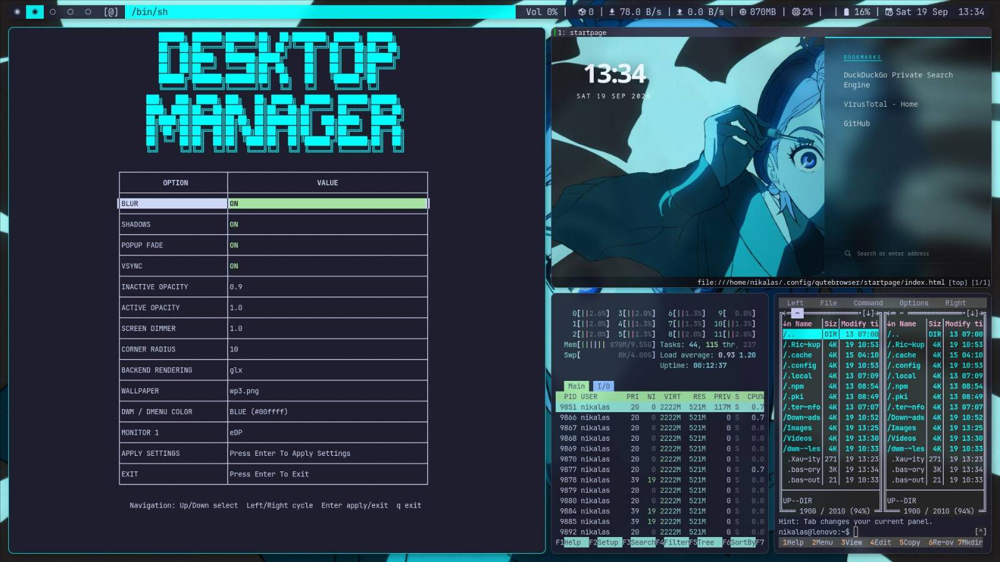
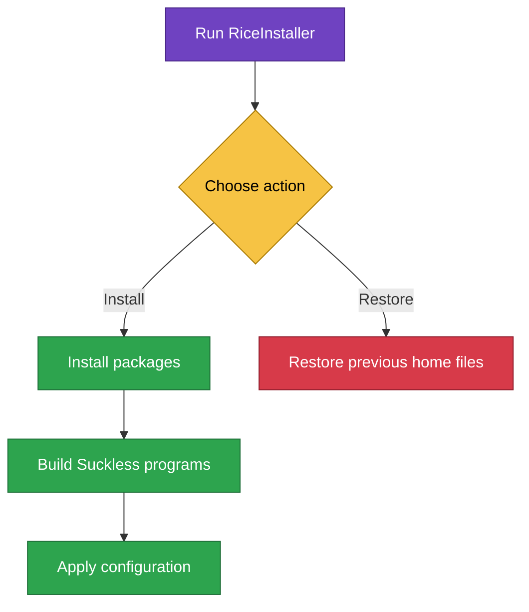

<div align="center">

# Arch Linux DWM Dotfiles

A complete, fast, and minimal DWM desktop environment for Arch Linux.

[About](#about) ·
[Installation](#installation) ·
[Keybindings](#keybindings) ·
[Packages](#packages) ·
[Scripts](#scripts) ·
[Documentation](#Documentation) ·
[Thank You](#thank-you)

</div>

## Showcase










## About

> The setup is designed for keyboard-driven use, though some websites and applications may still need a mouse.

> This repository contains a terminal-focused Arch Linux DWM setup. Security is your responsibility.

> USB management,file operations,media,servers and more are handled through the terminal.

> If you’re unfamiliar with the terminal, start with a more GUI-focused environment.

> Idle memory usage depends on hardware, configuration, and running services.

> My personal enviorment runs at 350mb/400 ram on idle.


The installer supports:
> Installer has been tested only on ext4 filesystem

- Installing the desktop environment
- Recovering configuration files
- Installing required Arch Linux packages
- Building Suckless programs from source
- Setting up applications and user services

## Installation

> This installer is intended for Arch Linux only.

### Requirements

- Arch Linux environment
- User in sudo group
- Python
- Git

### Installation flow

> Restore requires an unrestored backup created by the installer. It restores previous home files only; package installations/upgrades and system-file changes are not undone. See [backups and recovery](docs/Readmes/installer/README.md#backups-and-recovery).



### Install steps

#### 1. Clone the repository

Replace the URL with your actual repository URL.

```bash
git clone https://github.com/NT411/dwm-dotfiles
```

#### 2. Enter the repository

```bash
cd ~/dwm-dotfiles
```

#### 3. Make the installer executable

```bash
chmod +x RiceInstaller
```

#### 4. Run the installer

```bash
./RiceInstaller
```

#### 5. Start DWM

After installation, log out of any existing graphical session. From a TTY, start X:

```bash
startx
```
Alternatively, select **DWM (local dotfiles)** in a display manager. The bundled Bash login configuration does not start X automatically. A reboot is not required solely to load these dotfiles; reboot if needed for updates installed during the system upgrade.

### First-run setup

After installation:

- Press **Super + Enter** to open `st`.
- `ble.sh` loads automatically in Bash. To update it, optionally run `ble-update` in that shell; updating needs network access.
- Press **Super + V** to open Neovim and install its plugins.
- Press **Super + D** to open `deskctl` and configure your displays.
- Press **Super + B** to open qutebrowser.
- Run the following command in qutebrowser to update ad-blocking lists:

```text
:adblock-update
```

## Packages

The installer runs `sudo pacman -Syu --needed` with its package list, performing a full system upgrade and installing missing dependencies. Pacman retains its confirmation prompt.

Suckless programs such as `dwm`, `dmenu`, `st`, `slock`, and `slstatus` are built from the source code bundled in this repository.

### Development Packages

<details>
<summary>Show development packages</summary>

| Package | Description | Repository |
|:--------|:------------|:----------:|
| `base-devel` | Build tools | Arch Linux |
| `git` | Version control | Arch Linux |
| `neovim` | Text editor | Arch Linux |
| `nodejs` | JavaScript runtime | Arch Linux |
| `npm` | Node package manager | Arch Linux |
| `lazygit` | Git interface | Arch Linux |
| `clang` | C/C++ compiler | Arch Linux |
| `github-cli` | GitHub command-line tool | Arch Linux |
| `gimp` | Image editor | Arch Linux |

</details>

### System Packages

<details>
<summary>Show system packages</summary>

| Package | Description | Repository |
|:--------|:------------|:----------:|
| `bash` | Shell | Arch Linux |
| `sudo` | Admin commands | Arch Linux |
| `libx11` | X11 library | Arch Linux |
| `libxft` | Font library | Arch Linux |
| `libxinerama` | Multi-monitor support | Arch Linux |
| `libxrandr` | Display settings | Arch Linux |
| `libxext` | X11 extensions | Arch Linux |
| `libxcrypt` | Password hashing library | Arch Linux |
| `fontconfig` | Font configuration | Arch Linux |
| `freetype2` | Font rendering | Arch Linux |
| `ncurses` | Terminal interface library | Arch Linux |
| `xorg-server` | Display server | Arch Linux |
| `xorg-xinit` | X startup tool | Arch Linux |
| `xorg-xauth` | X authentication | Arch Linux |
| `xorg-xrandr` | Screen settings | Arch Linux |
| `xorg-xprop` | Window properties | Arch Linux |
| `xorg-xwininfo` | Window information | Arch Linux |
| `xorg-xdpyinfo` | Display information | Arch Linux |
| `xorg-xsetroot` | Root window settings | Arch Linux |
| `picom` | Window compositor | Arch Linux |
| `feh` | Image viewer | Arch Linux |
| `procps-ng` | Process tools | Arch Linux |
| `pacman-contrib` | Pacman utilities | Arch Linux |
| `ttf-jetbrains-mono-nerd` | Nerd Font | Arch Linux |
| `noto-fonts` | General fonts | Arch Linux |
| `noto-fonts-emoji` | Emoji fonts | Arch Linux |
| `adwaita-icon-theme` | Icon theme | Arch Linux |
| `adwaita-cursors` | Cursor theme | Arch Linux |
| `gtk3` | GTK 3 toolkit | Arch Linux |
| `gtk4` | GTK 4 toolkit | Arch Linux |
| `unzip` | ZIP extractor | Arch Linux |
| `xclip` | Clipboard tool | Arch Linux |
| `mc` | File manager | Arch Linux |
| `htop` | Process viewer | Arch Linux |
| `mpv` | Media player | Arch Linux |
| `gpu-screen-recorder` | Screen recorder | Arch Linux |
| `alsa-utils` | Audio tools | Arch Linux |
| `bluez-utils` | Bluetooth tools | Arch Linux |
| `libnotify` | Desktop notifications | Arch Linux |
| `pipewire` | Audio and video server | Arch Linux |
| `pipewire-pulse` | PulseAudio support | Arch Linux |
| `pipewire-alsa` | ALSA support | Arch Linux |
| `wireplumber` | Media session manager | Arch Linux |
| `flatpak` | Application manager | Arch Linux |
| `bluez` | Bluetooth support | Arch Linux |
| `ffmpeg` | Media framework | Arch Linux |
| `xdg-utils` | Desktop utilities | Arch Linux |
| `dconf` | Settings storage | Arch Linux |
| `gsettings-desktop-schemas` | Desktop settings | Arch Linux |
| `python` | Programming language | Arch Linux |
| `pkgconf` | Library configuration | Arch Linux |
| `ripgrep` | Text search tool | Arch Linux |
| `fd` | File finder | Arch Linux |
| `fzf` | Fuzzy finder | Arch Linux |
| `micro` | Text editor | Arch Linux |

</details>

### Web Packages

<details>
<summary>Show web packages</summary>

| Package | Description | Repository |
|:--------|:------------|:----------:|
| `qutebrowser` | Web browser | Arch Linux |
| `python-adblock` | Ad blocker | Arch Linux |
| `pdfjs` | PDF viewer library | Arch Linux |
| `yt-dlp` | Media downloader | Arch Linux |
| `qbittorrent` | Torrent client | Arch Linux |

</details>

## Keybindings

See the [qutebrowser keybindings](docs/Readmes/qutebrowser/README.md#keybindings) for browser shortcuts.

**Super** refers to the Windows key.

| Key | Action |
|:----|:-------|
| Super + Enter | Open terminal |
| Super + P | Open application launcher |
| Super + D | Open `deskctl` |
| Super + B | Open qutebrowser |
| Super + V | Open Neovim |
| Super + M | Open Midnight Commander |
| Super + H | Open `htop` |
| Super + S | Take a screenshot |
| Super + L | Lock the screen |
| Super + X | Close the focused window |
| Super + Left/Right | Move focus; cross tags at window-list boundaries and monitors at tag boundaries |
| Super + Alt + Left/Right | Reorder the focused window; move it across tags and monitors at boundaries |
| Super + `]` | Next layout |
| Super + `[` | Previous layout |
| Super + Shift + B | Toggle the status bar |
| Super + Alt + Q | Quit DWM |
| Volume Up/Down media keys | Adjust default PipeWire output volume by 5%; Fn may be needed depending on the keyboard |


## Scripts

| Script | Description |
|:-------|:------------|
| [RiceInstaller](RiceInstaller) | Starts the installer to install or recover the configuration |
| [deskctl.py](config/scripts/deskctl.py) | Configures displays and desktop settings; restores saved session settings at startup |
| [dmenu-launcher.sh](config/dmenu/dmenu-launcher.sh) | Positions the application launcher over the selected monitor's DWM bar |
| [start-dwm.sh](config/dwm/start-dwm.sh) | Applies desktop settings, restores wallpaper and brightness, starts slstatus and picom, and launches DWM |
| [script.js](config/qutebrowser/startpage/script.js) | Updates the clock, bookmarks, wallpaper, and accent color; handles search shortcuts |


## Documentation
- [st](docs/Readmes/st/README)
- [dwm](docs/Readmes/dwm/README.md)
- [slock](docs/Readmes/slock/README.md)
- [micro](docs/Readmes/micro/plug/filemanager/README.md)
- [dmenu](docs/Readmes/dmenu/README.md)
- [neovim](docs/Readmes/nvim/README.md)
- [deskctl](docs/Readmes/deskctl/README.md)
- [slstatus](docs/Readmes/slstatus/README.md)
- [qutebrowser](docs/Readmes/qutebrowser/README.md)

## Thank You

Huge thanks to the creators and communities whose work helped shape this setup:

- The Rice Installer was inspired by [gh0stzk/dotfiles](https://github.com/gh0stzk/dotfiles).
- The qutebrowser setup was inspired by [nathanWorkout/Qutebrowser-config](https://github.com/nathanWorkout/Qutebrowser-config).
- The Micro file manager plugin was taken from [claromes/filemanager-plugin](https://github.com/claromes/filemanager-plugin).
- A huge thank you to [Wallhaven](https://wallhaven.co) and all its contributors for providing amazing free wallpapers.
