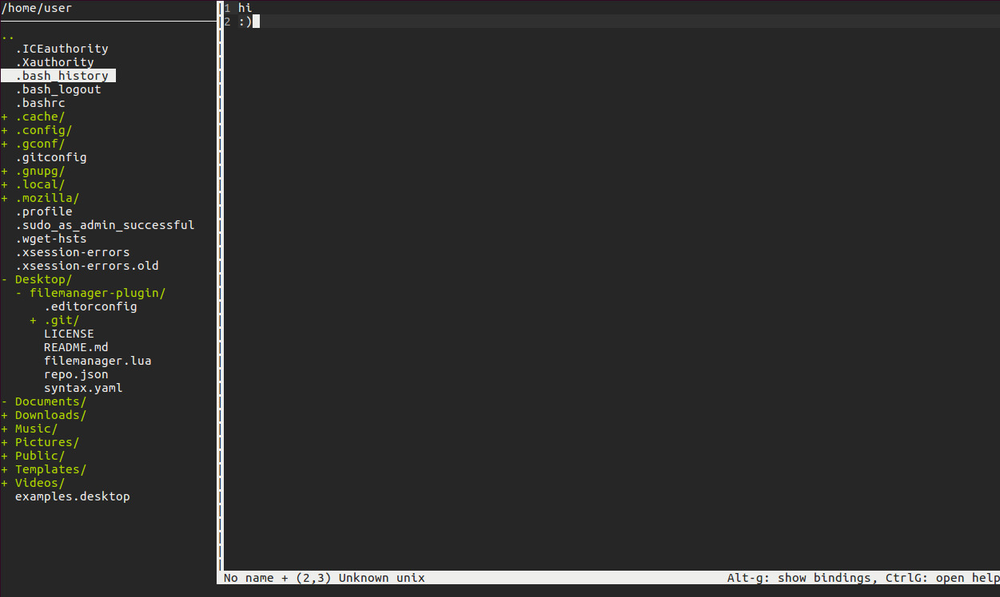

# Screenshot gallery

[Documentation index](../../README.md#documentation)

## Desktop themes

### Black

### Blue

### Brown

### Green

## Applications

- [Desktop manager guide](../Readmes/deskctl/README.md)

- [Qutebrowser guide](../Readmes/qutebrowser/README.md)

- [Micro filemanager guide](../Readmes/micro/plug/filemanager/README.md)

