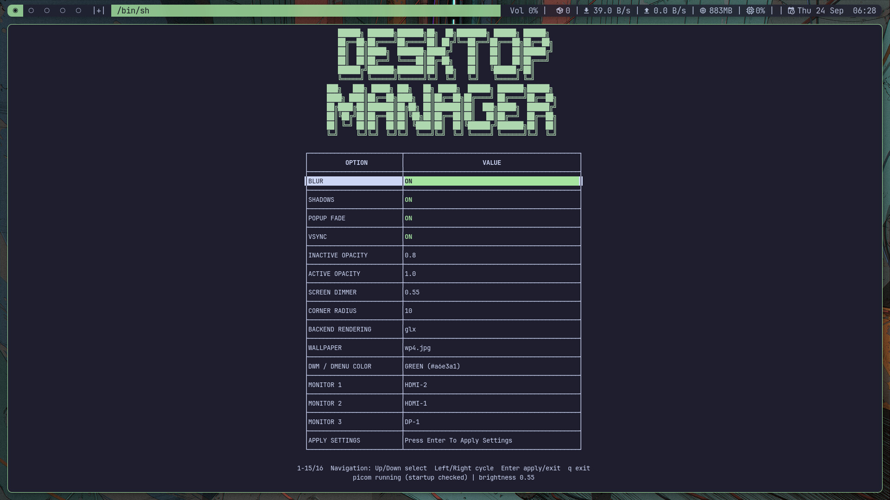

# Desktop manager (deskctl)

`deskctl` is the terminal-based settings interface for this DWM desktop. Its implementation is [config/scripts/deskctl.py](../../../config/scripts/deskctl.py). Persistent settings are stored in `~/.config/deskctl/`; [config/deskctl/](../../../config/deskctl/) contains the repository defaults.

## Opening and using the manager

After installation, press **Super + D** in DWM or run `deskctl` in a terminal inside your X11 session.

- **Up / Down** selects a setting.
- **Left / Right** changes a value.
- **Enter** opens a chooser or activates the selected action.
- **Esc / Q** returns from a submenu or exits the manager.

Changes are staged until you select **APPLY SETTINGS**. Monitor identification briefly dims the selected output immediately.

## Available settings

The interface controls Picom blur, shadows, popup fading, VSync, active and inactive opacity, corner radius, and rendering backend. It also offers wallpaper selection, screen dimming, DWM/Dmenu accent colors, and monitor orientation and ordering.

Applying settings writes to the installed configuration under `~/.config` and restarts Picom when compositing is needed, or stops it when all effects and VSync are disabled and opacity is fully opaque. The manager uses tools such as `xrandr` for displays and `feh` for wallpaper; the [installer](../installer/README.md) supplies the desktop dependencies.

## Saved state

- [session-state.json](../../../config/deskctl/session-state.json): desktop state restored at session startup.
- [display-brightness](../../../config/deskctl/display-brightness): saved screen dimming value.
- `~/.fehbg`: wallpaper restoration script.

Brightness changes target active monitors only. Session saves preserve monitor
positions and exact rotation, including left rotation and vertically arranged
screens. Explicitly changing monitor order or orientation still arranges them
in a horizontal row. Older saves without exact geometry are skipped for monitor
restoration; apply settings once to save the current arrangement.

The [DWM session launcher](../../../config/dwm/start-dwm.sh) invokes `deskctl.py --restore-session`, restores wallpaper, and applies saved brightness before starting DWM. Changes affect the installed files; they do not automatically update this repository.

[Back to documentation](../../../README.md#documentation)

[Documentation index](../../../README.md#documentation)
